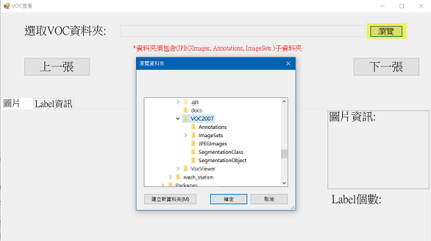
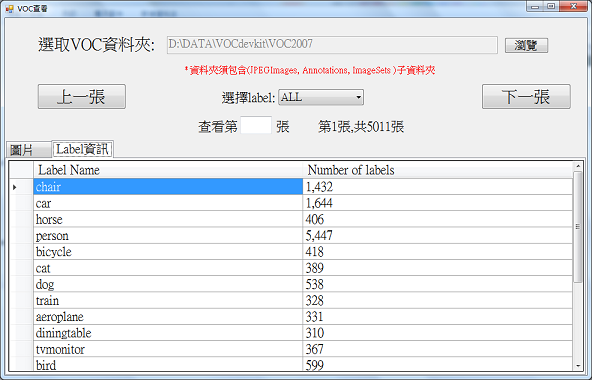
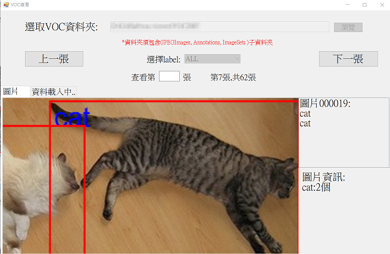
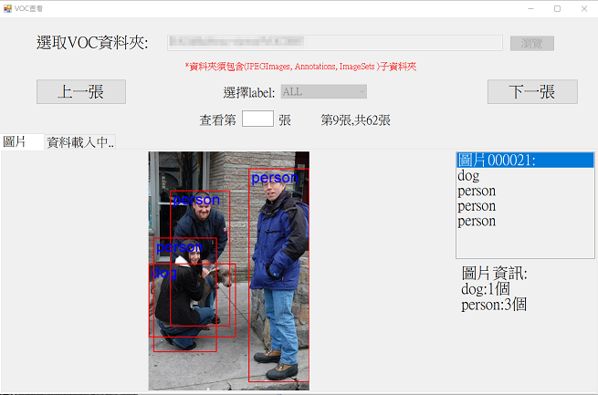
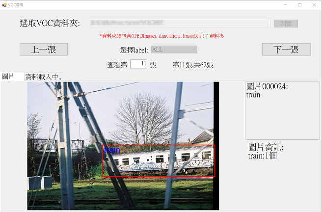

# VocViewer
<h2>此軟體可預覽圈選的資料集的狀態</h2> 
<h2>直接執行exe即可使用，此程式使用C# .Net framework 4.5.2開發</h2>

<h6>1.點選「瀏覽」選擇要看的voc資料夾，子資料夾必需包含Annotations、ImageSets、JPEGImages</h6>

    

 
<h6>2.選取後會讀出JPEGImages的資料夾圖片，並圈選出Annotations對應的圈選位子</h6>

    

 

<h6>3.「Label資訊」可帶出目前這個VOC資料夾圈選的統計</h6>

    

 

<h6>4.在圖片的地方使用滑鼠滾輪可將圖片放大縮小</h6>

    

 

<h6>5.「上一張」「下一張」按紐可切換圖片顯示</h6>

    

<h6>6.點選右邊圖片001兩下，可隱藏Label字樣</h6>

    
	

<h6>7.單選右邊label，可僅標示該物件</h6>

    

<h6>8.在查看_張欄位內，輸入照片號並按下Enter鍵，可直接跳至該張號碼照片</h6>

    

<h6>9.中央下拉選單選擇類型後，按「上一張」、「下一張」可過瀘切換該類型照片</h6>

    

 

# TODO
<h2>1.AI驗証引擎加入</h2>
<h2>2.Coco viewer</h2>
<h2>3.voc轉coco格式</h2>